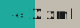
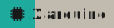
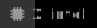
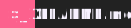
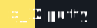

# Badges Collection

A comprehensive collection of standardized, high-quality badges for your projects. Generated with repository-specific color palettes and custom SVG icons.

## Usage

You can use these badges directly from the GitHub repository or via GitHub Pages.

<details>
<summary><strong>Expand Usage Examples</strong></summary>

### Markdown Example
```markdown

```

### HTML Example
```html

```

</details>

## Categories

<details>
<summary><strong>AI & Machine Learning</strong></summary>

| Badge | Name |
| --- | --- |
|  | `chatgpt` |
|  | `claude` |
|  | `copilot` |
|  | `gemini` |
|  | `huggingface` |
|  | `keras` |
|  | `llama` |
|  | `midjourney` |
|  | `mistral` |
|  | `ollama` |
|  | `openai` |
|  | `pytorch` |
|  | `stable-diffusion` |
|  | `tensorflow` |

</details>

<details>
<summary><strong>Analytics</strong></summary>

| Badge | Name |
| --- | --- |
|  | `amplitude` |
|  | `google-analytics` |
|  | `grafana` |
|  | `matomo` |
|  | `mixpanel` |
|  | `plausible` |
|  | `powerbi` |
|  | `tableau` |

</details>

<details>
<summary><strong>Browsers</strong></summary>

| Badge | Name |
| --- | --- |
|  | `arc` |
|  | `brave` |
|  | `chrome` |
|  | `chromium` |
|  | `edge` |
|  | `firefox` |
|  | `opera` |
|  | `safari` |
|  | `tor` |
|  | `vivaldi` |

</details>

<details>
<summary><strong>CI/CD</strong></summary>

| Badge | Name |
| --- | --- |
|  | `azure-pipelines` |
|  | `bitbucket-pipelines` |
|  | `circleci` |
|  | `drone` |
|  | `github-actions` |
|  | `gitlab-ci` |
|  | `jenkins` |
|  | `travis-ci` |

</details>

<details>
<summary><strong>Cloud Services</strong></summary>

| Badge | Name |
| --- | --- |
|  | `aws` |
|  | `azure` |
|  | `cloudflare` |
|  | `digitalocean` |
|  | `firebase` |
|  | `gcp` |
|  | `heroku` |
|  | `netlify` |
|  | `openstack` |
|  | `supabase` |
|  | `vercel` |

</details>

<details>
<summary><strong>Crypto</strong></summary>

| Badge | Name |
| --- | --- |
|  | `binance` |
|  | `bitcoin` |
|  | `coinbase` |
|  | `dogecoin` |
|  | `ethereum` |
|  | `monero` |
|  | `solana` |
|  | `tether` |

</details>

<details>
<summary><strong>Design Tools</strong></summary>

| Badge | Name |
| --- | --- |
|  | `after-effects` |
|  | `behance` |
|  | `blender` |
|  | `canva` |
|  | `dribbble` |
|  | `figma` |
|  | `gimp` |
|  | `illustrator` |
|  | `inkscape` |
|  | `krita` |
|  | `photoshop` |
|  | `premiere` |
|  | `sketch` |
|  | `xd` |

</details>

<details>
<summary><strong>Desktop Environments</strong></summary>

| Badge | Name |
| --- | --- |
|  | `awesome` |
|  | `bspwm` |
|  | `budgie` |
|  | `cinnamon` |
|  | `gnome` |
|  | `hyprland` |
|  | `i3` |
|  | `kde` |
|  | `lxqt` |
|  | `mate` |
|  | `openbox` |
|  | `plasma` |
|  | `qtile` |
|  | `sway` |
|  | `wayland` |
|  | `x11` |
|  | `xfce` |

</details>

<details>
<summary><strong>Development Tools</strong></summary>

| Badge | Name |
| --- | --- |
|  | `ansible` |
|  | `babel` |
|  | `docker` |
|  | `eslint` |
|  | `git` |
|  | `insomnia` |
|  | `kubernetes` |
|  | `nginx` |
|  | `npm` |
|  | `pm2` |
|  | `pnpm` |
|  | `postman` |
|  | `prettier` |
|  | `terraform` |
|  | `vite` |
|  | `webpack` |
|  | `yarn` |

</details>

<details>
<summary><strong>File Types</strong></summary>

| Badge | Name |
| --- | --- |
|  | `csv` |
|  | `json` |
|  | `markdown` |
|  | `pdf` |
|  | `txt` |
|  | `xml` |
|  | `yaml` |
|  | `zip` |

</details>

<details>
<summary><strong>Finance</strong></summary>

| Badge | Name |
| --- | --- |
|  | `amex` |
|  | `apple-pay` |
|  | `google-pay` |
|  | `klarna` |
|  | `mastercard` |
|  | `paypal` |
|  | `square` |
|  | `stripe` |
|  | `visa` |

</details>

<details>
<summary><strong>Frameworks</strong></summary>

| Badge | Name |
| --- | --- |
|  | `angular` |
|  | `astro` |
|  | `bootstrap` |
|  | `bulma` |
|  | `django` |
|  | `dotnet` |
|  | `electron` |
|  | `express` |
|  | `fastapi` |
|  | `flask` |
|  | `flutter` |
|  | `gatsby` |
|  | `laravel` |
|  | `less` |
|  | `nestjs` |
|  | `nextjs` |
|  | `nuxtjs` |
|  | `qt` |
|  | `rails` |
|  | `react` |
|  | `react-native` |
|  | `remix` |
|  | `sass` |
|  | `solid` |
|  | `spring` |
|  | `svelte` |
|  | `tailwind` |
|  | `tauri` |
|  | `vue` |

</details>

<details>
<summary><strong>Gaming</strong></summary>

| Badge | Name |
| --- | --- |
|  | `godot` |
|  | `minecraft` |
|  | `nintendo` |
|  | `playstation` |
|  | `roblox` |
|  | `steam` |
|  | `unity` |
|  | `unreal-engine` |
|  | `xbox` |

</details>

<details>
<summary><strong>Hardware</strong></summary>

| Badge | Name |
| --- | --- |
|  | `amd` |
|  | `apple-silicon` |
|  | `arduino` |
|  | `esp32` |
|  | `intel` |
|  | `nvidia` |
|  | `raspberry-pi` |
|  | `risc-v` |

</details>

<details>
<summary><strong>IDEs</strong></summary>

| Badge | Name |
| --- | --- |
|  | `android-studio` |
|  | `antigravity` |
|  | `clion` |
|  | `eclipse` |
|  | `goland` |
|  | `intellij` |
|  | `pycharm` |
|  | `rider` |
|  | `trae-ai` |
|  | `visual-studio` |
|  | `webstorm` |
|  | `xcode` |

</details>

<details>
<summary><strong>Licenses</strong></summary>

| Badge | Name |
| --- | --- |
|  | `apache` |
|  | `bsd` |
|  | `cc0` |
|  | `gpl` |
|  | `mit` |
|  | `mozilla` |
|  | `unlicense` |

</details>

<details>
<summary><strong>Miscellaneous</strong></summary>

| Badge | Name |
| --- | --- |
|  | `buymeacoffee` |
|  | `donate` |
|  | `ko-fi` |
|  | `liberapay` |
|  | `patreon` |
|  | `sponsors` |

</details>

<details>
<summary><strong>Operating Systems</strong></summary>

| Badge | Name |
| --- | --- |
|  | `android` |
|  | `arch` |
|  | `debian` |
|  | `fedora` |
|  | `freebsd` |
|  | `gentoo` |
|  | `ios` |
|  | `kali` |
|  | `linux` |
|  | `macos` |
|  | `nixos` |
|  | `parrot` |
|  | `ubuntu` |
|  | `windows` |
|  | `x` |

</details>

<details>
<summary><strong>Productivity</strong></summary>

| Badge | Name |
| --- | --- |
|  | `asana` |
|  | `clickup` |
|  | `jira` |
|  | `microsoft-teams` |
|  | `monday` |
|  | `notion` |
|  | `obsidian` |
|  | `slack` |
|  | `trello` |
|  | `zoom` |

</details>

<details>
<summary><strong>Programming Languages</strong></summary>

| Badge | Name |
| --- | --- |
|  | `ada` |
|  | `assembly` |
|  | `c` |
|  | `clojure` |
|  | `cobol` |
|  | `cpp` |
|  | `crystal` |
|  | `css` |
|  | `dart` |
|  | `elixir` |
|  | `elm` |
|  | `fortran` |
|  | `fsharp` |
|  | `go` |
|  | `groovy` |
|  | `haskell` |
|  | `html` |
|  | `java` |
|  | `javascript` |
|  | `julia` |
|  | `kotlin` |
|  | `lisp` |
|  | `lua` |
|  | `matlab` |
|  | `nim` |
|  | `objective-c` |
|  | `ocaml` |
|  | `pascal` |
|  | `perl` |
|  | `php` |
|  | `powershell` |
|  | `prolog` |
|  | `purescript` |
|  | `python` |
|  | `r` |
|  | `reason` |
|  | `ruby` |
|  | `rust` |
|  | `scala` |
|  | `shell` |
|  | `solidity` |
|  | `sql` |
|  | `swift` |
|  | `typescript` |
|  | `vala` |
|  | `verilog` |
|  | `vhdl` |
|  | `visual-basic` |
|  | `zig` |

</details>

<details>
<summary><strong>Project Status</strong></summary>

| Badge | Name |
| --- | --- |
|  | `alpha` |
|  | `beta` |
|  | `build-failing` |
|  | `build-passing` |
|  | `deprecated` |
|  | `maintained` |
|  | `stable` |
|  | `wip` |

</details>

<details>
<summary><strong>Social Badges</strong></summary>

| Badge | Name |
| --- | --- |
|  | `bitbucket` |
|  | `bluesky` |
|  | `dev.to` |
|  | `discord` |
|  | `github` |
|  | `gitlab` |
|  | `hackthebox` |
|  | `hashnode` |
|  | `instagram` |
|  | `kaggle` |
|  | `leetcode` |
|  | `linkedin` |
|  | `mastodon` |
|  | `medium` |
|  | `reddit` |
|  | `signal` |
|  | `stack-overflow` |
|  | `telegram` |
|  | `tryhackme` |
|  | `twitch` |
|  | `twitter` |
|  | `whatsapp` |
|  | `x` |
|  | `youtube` |

</details>

<details>
<summary><strong>Software Badges</strong></summary>

| Badge | Name |
| --- | --- |
|  | `aircrack-ng` |
|  | `burpsuite` |
|  | `ghidra` |
|  | `hashcat` |
|  | `john-the-ripper` |
|  | `metasploit` |
|  | `nmap` |
|  | `wireshark` |
|  | `xfetch` |
|  | `xtop` |

</details>

<details>
<summary><strong>Terminal Badges</strong></summary>

| Badge | Name |
| --- | --- |
|  | `LICENSE` |
|  | `README.md` |
|  | `alacritty` |
|  | `assets` |
|  | `foot` |
|  | `ghostty` |
|  | `gnome-terminal` |
|  | `hyper` |
|  | `iterm` |
|  | `kitty` |
|  | `konsole` |
|  | `mobaxterm` |
|  | `powershell` |
|  | `ptyxis` |
|  | `putty` |
|  | `references.md` |
|  | `roadmap.md` |
|  | `terminal.app` |
|  | `terminator` |
|  | `termux` |
|  | `tilix` |
|  | `warp` |
|  | `wezterm` |
|  | `xfce` |

</details>

<details>
<summary><strong>Text Editors</strong></summary>

| Badge | Name |
| --- | --- |
|  | `atom` |
|  | `code-oss` |
|  | `cursor` |
|  | `emacs` |
|  | `nano` |
|  | `neovim` |
|  | `notepad++` |
|  | `sublime-text` |
|  | `vim` |
|  | `vscode` |
|  | `vscodium` |

</details>

